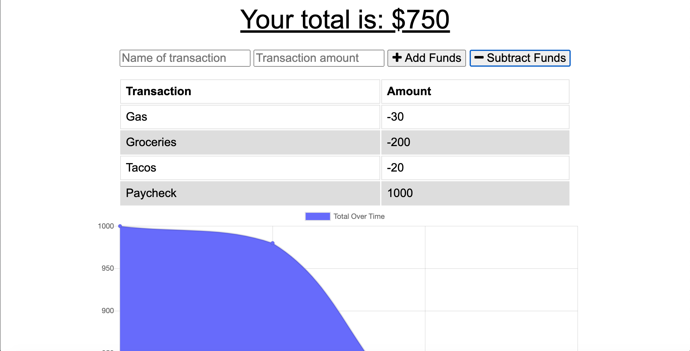

# Budget-Tracker

## This is a budget tracker application that can be used offline with functionallity.

## Table of Contents

- [Installation](#installation)
- [Usage](#usage)
- [License](#license)
- [Tests](#tests)
- [Contributors](#contributors)

## Installation

Packages required to run this program are: Compression, Express, Lite-Server, Morgan, Mongoose

## Usage

This application allows users to subtract expenses and add deposits to their budget. If a user does not have connection they can still update their budget. Once connection is restored their transactions will be updated.

## License

None

## Tests

            To test, run the following command: node server.js

## Demo

## Contributors

- Cody Walter

## Contact

## View the project repository in GitHub at: https://github.com/codywalter/Budget-Tracker

## View deployed site at: https://ancient-headland-53837.herokuapp.com/

### If you have any questions, contact the author directly at: cody.walter@providencecc.edu
